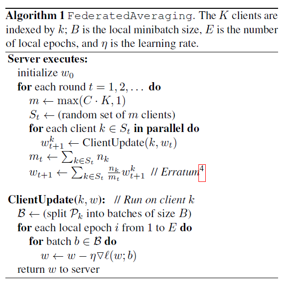
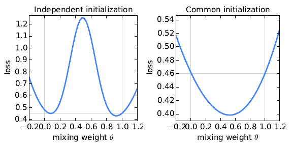

# Literature Summary: Communication-Efficient Learning of Deep Networks

**Collaborators:** Sourit Mitra & Sagnik Chowdhury

## 1. Overview & The Core Problem
Modern mobile devices generate a massive wealth of data (e.g., text, images) that is ideal for training intelligent models, but this data is often highly privacy-sensitive and bandwidth-heavy. Traditional machine learning requires logging this raw data to a centralized data center, which introduces significant privacy risks and communication bottlenecks. 

This paper introduces the problem of training on decentralized data and proposes a practical algorithm to solve it. The primary advantage of this approach is the decoupling of model training from the need for direct access to the raw training data.

## 2. The Federated Learning Architecture
To address these constraints, the authors propose **Federated Learning**, a decentralized approach where the learning task is solved by a loose federation of participating devices (clients) coordinated by a central server. 

The architecture operates under the principle of data minimization:
* Each client maintains a local training dataset that is **never** uploaded to the server.
* The central server sends the current global model to a random fraction of clients.
* Clients compute an update to the model locally and transmit only this ephemeral update back to the server over a mix network.
* Once the server aggregates the updates to improve the global model, the individual updates are discarded.

## 3. Federated Optimization & The Mathematical Objective
Federated optimization differs drastically from traditional distributed optimization (like data center clusters) due to four key properties:
1. **Non-IID:** A user's local dataset represents their personal usage and is not a representative sample of the overall population distribution.
2. **Unbalanced:** Users interact with apps at different rates, leading to vastly different amounts of local training data per client.
3. **Massively Distributed:** The number of participating clients is exponentially larger than the average number of examples per client.
4. **Limited Communication:** Mobile devices operate on slow, expensive, or intermittent connections.

To frame this mathematically, the algorithm assumes any standard finite-sum objective (like minimizing the loss of a prediction). If $n$ is the total number of data points across all devices, the global objective is:
$$f(w) = \frac{1}{n} \sum_{i=1}^n f_i(w)$$

In a federated setting with $K$ clients, the data is partitioned. If client $k$ holds $n_k$ data points, the local objective for that specific client is $F_k(w)$:
$$F_k(w) = \frac{1}{n_k} \sum_{i \in \mathcal{P}_k} f_i(w)$$

This allows us to rewrite the global objective as a weighted average of the local client objectives:
$$f(w) = \sum_{k=1}^K \frac{n_k}{n} F_k(w)$$

If the data were uniformly distributed (IID), the expected value of any local $F_k(w)$ would equal the global $f(w)$. However, in this non-IID environment, $F_k(w)$ could be a very poor approximation of $f(w)$, making the optimization highly complex.

## 4. Overcoming Communication Bottlenecks
Because mobile computation (CPUs/GPUs) is essentially free compared to the heavy cost of mobile network communication, the primary goal is to use additional on-device computation to dramatically decrease the number of communication rounds required . 

This is achieved by:
* **Increased Parallelism:** Using more clients independently between rounds.
* **Increased Local Computation:** Having each client perform a complex calculation (multiple epochs of training) rather than a simple single gradient calculation before sending the update.

## 5. The FederatedAveraging (FedAvg) Algorithm

To solve the federated optimization problem, the authors start by adapting Stochastic Gradient Descent (SGD) to the decentralized setting. 

### The Baseline: FederatedSGD (FedSGD)
A naive approach is to use large-batch synchronous SGD. In each communication round, the server selects a $C$-fraction of clients[cite: 129]. Each selected client $k$ computes the average gradient on its local data at the current global model $w_t$:
$$g_k = \nabla F_k(w_t)$$
The central server then aggregates these local gradients and applies the update:
$$w_{t+1} \leftarrow w_t - \eta \sum_{k=1}^K \frac{n_k}{n} g_k$$
While computationally efficient, FedSGD requires an impractical number of communication rounds to achieve convergence in a mobile network environment.

### The Innovation: FederatedAveraging (FedAvg)
To reduce communication costs, the authors propose shifting the computational load to the clients. Instead of taking a single gradient step and communicating immediately, each client iterates the local update multiple times before the averaging step:
$$w^k \leftarrow w^k - \eta \nabla F_k(w^k)$$
The server then takes a weighted average of these resulting locally trained models[cite: 133]. [cite_start]The amount of local computation is controlled by three hyperparameters:
* **$C$**: The fraction of clients selected per round.
* **$E$**: The number of local training epochs (passes over the local dataset).
* **$B$**: The local minibatch size used for client updates.

### FedAvg Pseudocode
Below is the formal algorithm for FederatedAveraging, demonstrating the server execution loop and the parallel client update process:

### The Initialization Phenomenon
Averaging models in parameter space for non-convex objectives (like deep neural networks) can normally produce arbitrarily bad models if they are trained from different random initializations. 

However, FedAvg inherently sidesteps this issue. [cite_start]Because all clients begin their local training epochs from the *exact same shared global model* ($w_t$) sent by the server, naive parameter averaging works surprisingly well and achieves significant reductions in loss.

## 6. Key Results & Empirical Evaluation

[cite_start]The authors conducted an extensive empirical evaluation across different model architectures and datasets to test FedAvg's robustness, specifically against unbalanced and non-IID data[cite: 184, 185, 193].

* **MNIST Digit Recognition (CNN & 2NN):** FedAvg dramatically reduced the required communication rounds. For the IID partition, it required up to 35x fewer rounds for the CNN and 46x fewer for the 2NN compared to the FedSGD baseline. Impressively, it also converged successfully on pathologically partitioned non-IID data (where a client only had examples of two digits).
* **Shakespeare Language Modeling (LSTM):** This dataset acted as a highly realistic proxy for unbalanced, non-IID mobile typing data. FedAvg performed exceptionally well here, achieving a 95x speedup in communication rounds compared to the baseline.
* **CIFAR-10 Image Classification:** Even on more complex image data, FedAvg achieved a target test accuracy of 85% in only 2,000 communication rounds, whereas standard SGD required drastically more updates to reach the same threshold.

**Conclusion:** The experiments decisively prove that federated learning is practical. By allowing devices to perform more local computation ($E > 1$, smaller $B$), FedAvg reduces the required communication rounds by 10-100x, enabling deep networks to be trained directly from decentralized, privacy-sensitive data.
